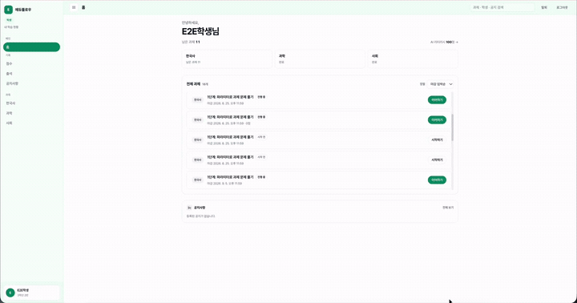

# EduFlow

중·고등학생 AI 리터러시 교육을 위한 학습 플랫폼입니다.  
선생님은 과제를 내고, 학생은 RAG·환각 탐지·토론·보안 시나리오를 따라가며 AI를 비판적으로 다루는 연습을 합니다.

<!-- 내일 교체: 데모 GIF 또는 히어로 스크린샷

-->

## Repositories

| Repo | Role |
|------|------|
| [`frontend`](https://github.com/eduflow-team/frontend) | 학생·교사 웹 (React + Vite) |
| [`backend`](https://github.com/eduflow-team/backend) | API · DB · 채점 (FastAPI + PostgreSQL + pgvector) |
| [`ai`](https://github.com/eduflow-team/ai) | Langflow 워크플로 · 로컬 AI 환경 |

## Learning stages

1. **RAG 체험** — 학습 자료를 바탕으로 AI와 대화하며 서술형 답안을 작성 (키포인트 부분 채점)
2. **Hallucination 탐지** — AI 답변의 오류를 찾고 유형을 분류
3. **AI 토론** — 찬반 에이전트 토론을 평가자로 검증
4. **보안 강화** — 프롬프트 인젝션에 대응하는 실습

## Quick start (local)

자세한 설정은 각 레포 README를 참고하세요.

```bash
# backend
cd backend && docker compose up -d
# frontend
cd frontend && npm install && npm run dev
```

- Frontend: `http://localhost:5173`
- Backend docs: `http://localhost:8000/docs`

## Branch

- `develop` — 통합·일상 작업 기준
- `main` — 안정 반영 (레포별로 시점이 다를 수 있음)

## Screenshots

> 내일 추가 예정
>
> - 학생 Stage1 (채팅 + 서술형 제출)
> - 채점 결과 (키포인트 체크)
> - 선생님 출제 (키포인트 3개)
> - (선택) 대시보드

## Team

EduFlow — 한이음 프로젝트

---

<!-- 작업 메모 (공개 README에서 지워도 됨)
- demo.gif / 스크린샷 넣기
- 팀원·역할 링크
- 배포 URL 있으면 상단에 배지
-->
